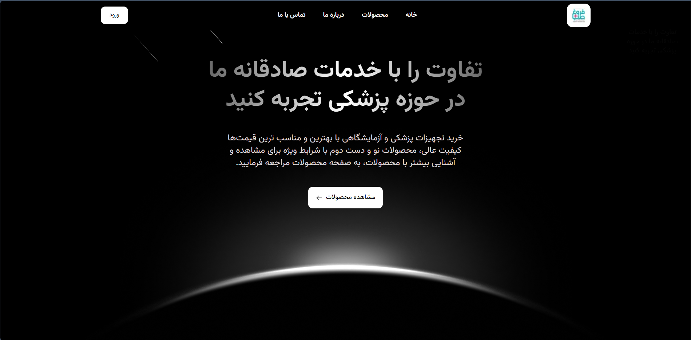

# MedicalEquipment-Project
The Medical Equipment Web App for FroghTeb Ronak Sina in Hamadan 

## images

  
## Description
This project was developed for FroghTeb Ronak Sina, utilizing TypeScript and the Next.js framework for the frontend, and Python with Django REST Framework for the backend. The web application features a modern, visually appealing, and fully responsive design, ensuring a seamless and user-friendly experience across all devices. The implementation emphasizes both functionality and professionalism, making it suitable for formal use in a medical equipment context.

## Features
- Responsive design for optimal viewing on various devices
- User-friendly interface with intuitive navigation
- Secure user authentication and authorization
- RESTful API for data management

## Technologies Used
### frontend
- NextJs
- TypeScript
- Tailwind CSS
- Framer Motion
- SwiperJs
- Lottie
- Leaflet
### backend
- Python
- django-rest-framework
- PostgreSQL

## Installation

1. Clone the repository:
   ```bash
   git clone https://github.com/yourusername/MedicalEquipment-Project.git
   ```

2. Navigate to the project directory:
   ```bash
   cd MedicalEquipment-Project
   ```

3. Install dependencies for the backend:
   ```bash
   cd backend
   pip install -r requirements.txt
   ```

4. Install dependencies for the frontend:
   ```bash
   cd frontend
   npm install
   ```

5. Start the development servers:
   ```bash
   # In the backend directory
   python manage.py runserver

   # In the frontend directory
   npm run dev
   ```

## Contributing
If you'd like to contribute to this project, please fork the repository and submit a pull request.

## License
This project is licensed under the MIT License - see the [LICENSE](LICENSE) file for details.

## Author
- **Mohammad Arshia Jafari** – Backend Developer  
- **Mohammad Javad Majlesi** – Frontend Developer  
- **Ashkan Azimi** – SEO Specialist

